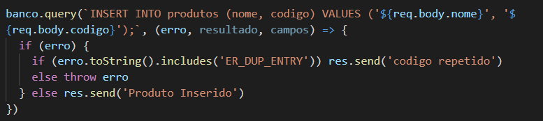

# Quasar App (node-com-mysql)

A Quasar Framework app

## Tecnologias

- Quasar Framework
- MySQL
- NodeJS
- Remote MySQL

## Instalando o que você precisa

### Módulo mysql

```bash
npm install mysql --save
```

### Módulo cors

```bash
npm install cors --save
```

### Express Framework

```bash
npm install express --save
```

## Uso do Módulo mysql

Depois de ter instalado este módulo precisamos importar ele para nosso projeto através do require:

```bash
const mysql = require('mysql')
```

Depois de importado precisamos "settar" as configurações da conexão com o banco de dados.


Só então podemos fazer a conexão com o banco de dados


Depois de conectado podemos "Conversar" com o Banco de Dados.



O método query() recebe dois parâmetros. O primeiro é o código SQL para o banco de dados e o segundo é uma função de callback, esta por sua vez recebe três parâmetros: erro, resultado e campos.

Se ao executar o código SQL houver algum erro então o parametro receberá as informações acerca deste erro. Já o parâmetro resultado varia de acordo com o código SQL enviado para o banco, se o código enviado é de consulta então "resultado" terá o valor da resposta do banco de dados.

Após fazer todas as ações necessárias é preciso encerrar a conexão através de:


## Relacionando dados pelas chaves estrangeiras

### Recuperando apenas os dados que interessam

```bash
select clientes.nome, produtos.nome FROM compra JOIN produtos, clientes 
where produtos.codigo = compra.codigoProduto and clientes.id = compra.idCliente;
```

## Install the dependencies
```bash
npm install
```

### Start the app in development mode (hot-code reloading, error reporting, etc.)
```bash
quasar dev
```

### Lint the files
```bash
npm run lint
```

### Build the app for production
```bash
quasar build
```

### Customize the configuration
See [Configuring quasar.conf.js](https://quasar.dev/quasar-cli/quasar-conf-js).
